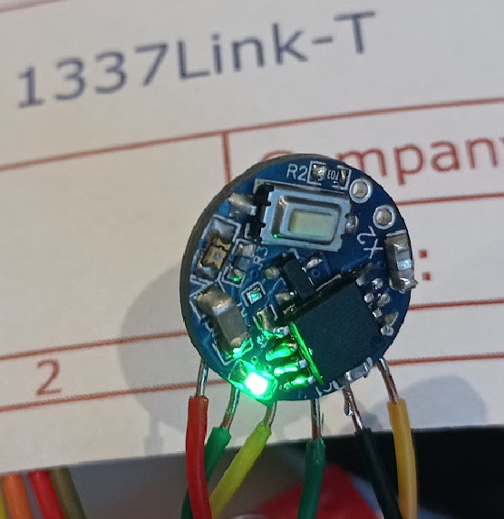

# 1337Link-T

A fork of the awesome <a href="http://www.adafruit.com/products/73">TV-B-Gone V2</a>, in the format of a cufflink. They'll never see it coming! (until they see this GitHub...)

## How it works
The working principle is very similar to the TV-B-Gone V2, except miniaturized and with only one wide-angle infrared (IR) LED. An ATTiny85 microcontroller sleeps in low-power mode, wakes up when you press the button (wired to its reset line), and sends out all of the TV power codes one by one. Although the single 60° (angle of half intensity) LED doesn't give it as much range, the 1337Link is much more discreet (well, it will be after I replace that incredibly bright green LED); it's also powered by a small LiPo battery (that I had lying around), which can be neatly tucked into your shirt cuffs.  

## Design notes
Schematic files available soon.
I used an ATTiny85 instead of the 85V variant, just because it was available during the chip shortage of 2022. 
As I was only driving one SMD LED, I used the single transistor of the TV-B-Gone V1 to control the LED. All the circuitry is packed onto one 18mm dia. PCB and glued onto a cufflink blank with superglue.

Thanks to <a href="https://github.com/adafruit/TV-B-Gone-kit">Adafruit's original repo</a> for providing the well-commented code that this project uses. 

> When we were putting together the TV-B-Gone kit, we started imagining a dystopian future, filled with televisions, where this kit would be super useful and we'd be a hero for having one.  And while maybe that's dramatic, the TV-B-Gone is perfect for playing pranks on your friends during the Super Bowl or getting some peace and quiet during dinner.

> The TV-B-Gone is a kit that, when soldered together, allows you to turn off almost any television within 150 feet or more.  It works on over 230 total power codes - 115 American/Asian and another 115 European codes.  You can select which zone you want during kit assembly.

> This is an unassembled kit which means that soldering is required - but it's very easy and a great introduction to soldering in general.  The kit's powered by 2x AA batteries - that aren't included - and the output comes from 2x narrow beam IR LEDs and 2x wide-beam IR LEDs.  

> The TV-B-Gone covers almost any television from the brands listed below, including the latest flat-screens and plasma TVs.  There's also lots more info on the [TV-B-Gone website](https://learn.adafruit.com/tv-b-gone-kit).

> And now for the brands!

> Acer, Admiral, Aiko, Alleron, Anam National, AOC, Apex, Baur, Bell&Howell, Brillian, Bush, Candle, Citizen, Contec, Cony, Crown, Curtis Mathes, Daiwoo, Dimensia, Electrograph, Electrohome, Emerson, Fisher, Fujitsu, Funai, Gateway, GE, Goldstar, Grundig, Grunpy, Hisense, Hitachi, Infinity, JBL, JC Penney, JVC, LG, Logik, Loewe, LXI, Majestic, Magnavox, Marantz, Maxent, Memorex, Mitsubishi, MGA, Montgomery Ward, Motorola, MTC, NEC, Neckermann, NetTV, Nikko, NTC, Otto Versand, Palladium, Panasonic, Philco, Philips, Pioneer, Portland, Proscan, Proton, Pulsar, Pye, Quasar, Quelle, Radio Shack, Realistic, RCA, Samsung, Sampo, Sansui, Sanyo, Scott, Sears, SEI, Sharp, Signature, Simpson, Sinudyne, Sonolor, Sony, Soundesign, Sylviana, Tatung, Teknika, Thompson, Toshiba, Universum, Viewsonic, Wards, White Westinghouse, Zenith
